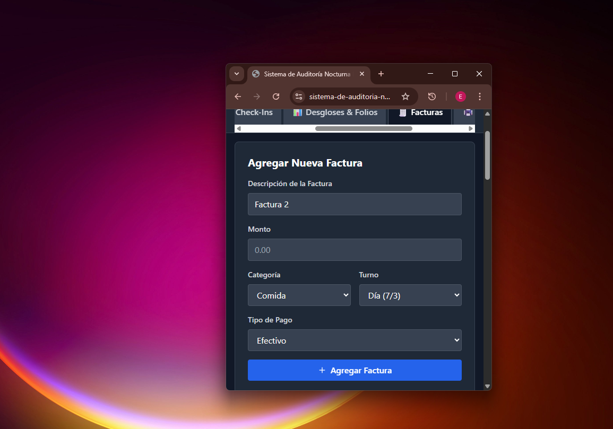

# Sistema de Auditoría Nocturna

Una aplicación web completa para la gestión y seguimiento del proceso de auditoría nocturna en hoteles, desarrollada con React, TypeScript y Tailwind CSS.


## 📋 Descripción

El Sistema de Auditoría Nocturna es una herramienta digital diseñada para optimizar y estandarizar el proceso de auditoría en establecimientos hoteleros. La aplicación guía paso a paso a través de todos los procedimientos necesarios, desde la preparación inicial hasta la generación de reportes finales.

## ✨ Características Principales

### 🎯 Gestión Completa del Proceso

- **Preparación inicial** con temporizador crítico para el cierre del Verifón
- **Verificación de check-outs** con validación de pagos y facturas
- **Procesamiento de check-ins** con control de tarifas y documentación
- **Desgloses automatizados** de ventas por categorías y turnos
- **Generación de reportes** para contabilidad y ama de llaves

### 💾 Almacenamiento Persistente

- **LocalStorage integrado** para mantener datos entre sesiones
- **Auto-numeración** progresiva de facturas (Factura 1, 2, 3...)
- **Recuperación automática** de datos al reiniciar la aplicación
- **Funcionalidad de limpieza** con confirmación de seguridad

### 📊 Sistema de Facturas Avanzado

- **Categorización automática**: Comida, Bebidas, Tienda
- **Separación por turnos**: Día (7/3) y Noche (3/11)
- **Tipos de pago**: Efectivo y Tarjeta de Crédito
- **Resúmenes en tiempo real** con totales por categoría

### ⏰ Temporizador Crítico

- **Countdown en tiempo real** hasta el cierre del Verifón (11:55 PM)
- **Alertas urgentes** cuando quedan menos de 30 minutos
- **Visualización clara** de horas, minutos y segundos restantes

### 📈 Seguimiento de Progreso

- **Barra de progreso** general del proceso de auditoría
- **Progreso por categorías** con porcentajes individuales
- **Marcado de pasos completados** con confirmación visual
- **Estado visual** diferenciado para tareas pendientes y completadas

## 🚀 Instalación y Configuración

### Requisitos Previos

- Node.js (versión 18 o superior)
- npm o yarn

### Instalación

```bash
# Clonar el repositorio
git clone https://github.com/EnmanuelReynoso23/Sistema-de-auditoria-nocturna.git

# Navegar al directorio del proyecto
cd Sistema-de-auditoria-nocturna

# Instalar dependencias
npm install

# Iniciar el servidor de desarrollo
npm run dev
```

### Construcción para Producción

```bash
# Generar build de producción
npm run build

# Vista previa del build
npm run preview
```

## 📱 Uso de la Aplicación

### Navegación Principal

La aplicación está organizada en pestañas principales:

1. **📋 Preparación** - Configuración inicial y cierre del Verifón
2. **✅ Check-Outs** - Verificación de salidas y pagos
3. **🏨 Check-Ins** - Procesamiento de entradas
4. **📊 Desgloses & Folios** - Creación de folios y cálculos
5. **🧾 Facturas** - Gestión de facturas con auto-numeración
6. **🖨️ Reportes** - Generación de documentos finales
7. **⏰ Temporizador** - Control de tiempo crítico

### Gestión de Facturas

#### Agregar Nueva Factura

1. La descripción se auto-completa con "Factura X"
2. Insertar el monto (campo vacío para fácil escritura)
3. Seleccionar categoría: Comida, Bebidas o Tienda
4. Elegir turno: Día (7/3) o Noche (3/11)
5. Especificar tipo de pago: Efectivo o Tarjeta
6. Hacer clic en "Agregar Factura"

#### Resumen Automático

- **Totales por categoría** separados por turno y tipo de pago
- **Cálculos en tiempo real** que se actualizan automáticamente
- **Desglose detallado** para facilitar el proceso de auditoría

## 🛠️ Tecnologías Utilizadas

### Frontend

- **React 18.3.1** - Biblioteca de interfaz de usuario
- **TypeScript 5.6.2** - Tipado estático para JavaScript
- **Tailwind CSS 3.4.14** - Framework de CSS utilitario
- **Lucide React** - Iconografía moderna y consistente

### Herramientas de Desarrollo

- **Vite 5.4.19** - Herramienta de construcción rápida
- **ESLint** - Linting de código
- **PostCSS** - Procesamiento de CSS
- **Autoprefixer** - Prefijos automáticos de CSS

## 🏗️ Estructura del Proyecto

```text
src/
├── components/          # Componentes reutilizables
│   ├── AdvancedAnalytics.tsx
│   ├── DataExport.tsx
│   └── PrintableReports.tsx
├── App.tsx             # Componente principal
├── main.tsx            # Punto de entrada
├── index.css           # Estilos globales
└── vite-env.d.ts       # Definiciones de tipos para Vite
```

## 📋 Proceso de Auditoría Detallado

### Fase 1: Preparación

- Adecuar área de trabajo para papeles de auditoría
- **CRÍTICO**: Cierre del Verifón antes de las 11:55 PM

### Fase 2: Check-Outs

- Verificación en Hotello → Departures
- Validación de montos, números de aprobación y tipos de tarjeta
- Revisión de facturas físicas vs. cargadas al sistema
- Procesamiento de propinas del restaurante

### Fase 3: Check-Ins

- Revisión en Hotello → In-House
- Verificación de pagos y tarifas
- Organización de documentos por categorías

### Fase 4: Desgloses y Folios

- Separación manual de ventas por categoría y tipo de pago
- Creación de folios específicos:
  - Beach Club 107 (comida del bar)
  - Bar Beverages 109 (bebidas)
  - Gift Shop 901 (tienda)

### Fase 5: Reportes Finales

- Generación de documentos para contabilidad
- Impresión de reportes para ama de llaves
- Organización final de documentación

## 🔧 Configuración Personalizada

### Variables de Entorno

```env
# Ejemplo de configuración (si se requiere)
VITE_APP_TITLE=Sistema de Auditoría Nocturna
VITE_DEADLINE_HOUR=23
VITE_DEADLINE_MINUTE=55
```

### Personalización de Horarios

El temporizador está configurado para el cierre a las 11:55 PM, pero puede modificarse en el código según las necesidades del establecimiento.

## 🤝 Contribución

Las contribuciones son bienvenidas. Para contribuir:

1. Fork del repositorio
2. Crear una rama para la nueva funcionalidad (`git checkout -b feature/nueva-funcionalidad`)
3. Commit de los cambios (`git commit -m 'Agregar nueva funcionalidad'`)
4. Push a la rama (`git push origin feature/nueva-funcionalidad`)
5. Abrir un Pull Request

## 📄 Licencia

Este proyecto está bajo la Licencia MIT. Ver el archivo `LICENSE` para más detalles.

## 📞 Soporte

Para soporte técnico o consultas:

- **Repository**: [GitHub](https://github.com/EnmanuelReynoso23/Sistema-de-auditoria-nocturna)
- **Issues**: Reportar problemas en GitHub Issues

## 🔄 Changelog

### v1.0.0

- Implementación inicial del sistema completo
- Sistema de facturas con auto-numeración
- Almacenamiento persistente con LocalStorage
- Temporizador crítico para cierre del Verifón
- Resúmenes automáticos por categorías y turnos
- Interfaz responsiva con Tailwind CSS

---

**Sistema de Auditoría Nocturna** - Desarrollado para optimizar procesos hoteleros con tecnología moderna y confiable.
